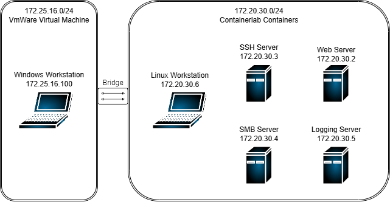
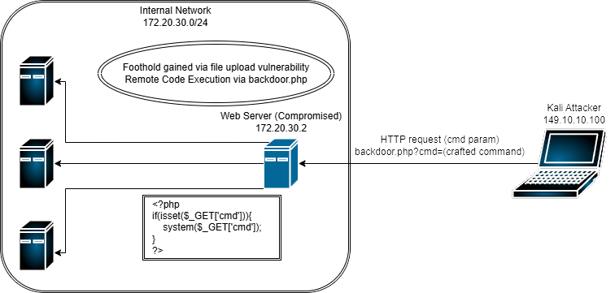

# Lateral-Movement-Simulation
This is a paper I wrote on simulating the nine lateral movement techniques categorized by the MITRE ATT&amp;CK framework in a virtual test environment.

## Abstract
Lateral movement represents a critical phase in a cyberattack’s life cycle, where a malicious actor
aims to navigate the internal network after initial access. This project aims to simulate the nine primary
lateral movement techniques defined by the MITRE ATT&CK framework. Its primary objective
is producing a set of guidelines to help with detection and mitigation by combining practical observation
and empiric background literature. The goal is for it to improve adhering to the documented
MITRE framework’s tactics against lateral movement. A virtualized environment was designed using
containerized Linux systems and VMware-based Windows virtual machines. Controlled reachability
between the devices ensured realistic conditions while maintaining clarity for observation.
Each technique was executed using a step-by-step process, consisting of attack setup, exploitation,
detection, countermeasure implementation, and re-evaluation after mitigation strategies. Results
showed that even straightforward countermeasures, such as log monitoring and proper firewall 
sementation, could significantly reduce the likelihood of many lateral movement attempts. The attacker’s
initial access, while not heavily focused on in this project, is gained through very poor security 
practices. However, these lateral movement mitigation strategies show that the attacker can be limited to
only the initial compromised device if proper defensive measures are taken. The resulting guidelines
created from this report integrate the practical recommendations that were tested in the simulation
with established defensive strategies outlined in cybersecurity literature. The guidelines are based on
the results of the simulation but lean more on the literature for techniques that were harder to simulate
in the constrained and lightweight simulation environment. These guidelines are intended to help
network defenders more effectively harden virtualized network environments against lateral movement
attempts.

Keywords: Lateral Movement, MITRE ATT&CK Framework, Network Simulation, Virtualization, Network Security

